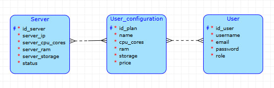

# EasyVPS
The application for a customisable VPS rental shop called EasyVPS.
The **user** will be able to choose his own **configuration**  for his VPS instance.

The relational database chosen is **PostgreSQL**.
## Schema

## Business operation
Before adding a user's configuration to the server, it is necessary to check the server's resource availability (a single server can host multiple instances belonging to the same or different users). If the server is already overloaded, the instance should be assigned to a different server.
## Complex query
Select users who have more than 3 instances at a time.

