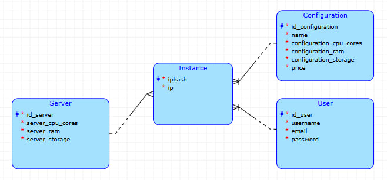

# UnReality
The application is a property management system for real estate agency UnReality.
The **owner** will be able to add his **property** and the landlord will be able to rent it out. One property can be rented by multiple **tenants** and one **tenant** can rent multiple properties.

The relational database chosen is **PostgreSQL**.
## Schema

## Business operation
It must be ensured that no more than 4 people can rent one property at a time.
## Complex query
Select owners with more than five properties registered.

